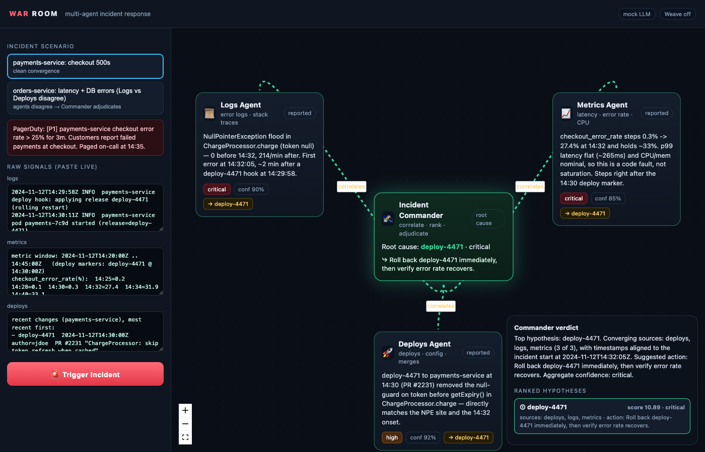

# 🛰️ War Room — a multi-agent incident-response crew

> When production breaks at 3am, one on-call engineer alt-tabs between logs,
> metrics, and deploy history, holding three investigation threads in their
> head at once. **War Room replaces that with a crew**: three specialist agents
> investigate *in parallel*, and an **Incident Commander** correlates their
> findings across time to return a ranked root-cause hypothesis and a suggested
> action.

Mess in (raw logs + metrics + deploys) → **root cause out**.



---

## What it does (2 sentences)

War Room dispatches a production alert to three specialist investigators — **Logs**,
**Metrics**, and **Deploys** — that run concurrently and each return a *structured
finding*. The **Incident Commander** correlates those findings programmatically (by
`points_to` convergence and timestamp alignment) and emits a ranked root-cause
hypothesis with a suggested action and an aggregate confidence — e.g. *"Error spike
at 14:32 correlates with deploy-4471 to payments-service at 14:30 — likely root
cause. Roll back #4471. Confidence: high."*

## Why it's a *crew* and not a script

Remove the multi-agent part and you're back to one overloaded human. The value is
**parallel fan-out + cross-source correlation**: the three investigators look at
different evidence simultaneously, and the Commander is the only component that can
*correlate across sources* — something no single agent (and no exhausted human at
3am) does well.

---

## Architecture

```
                 ┌─────────────────────────────────────────┐
                 │            Incident Commander            │   gpt-4o
                 │  dispatch · correlate · rank · adjudicate │
                 └───────┬───────────┬───────────┬──────────┘
        A2A Task ────────┤           │           ├──────── A2A Task
                         ▼           ▼           ▼
                   ┌─────────┐ ┌─────────┐ ┌─────────┐        gpt-4o-mini
                   │  Logs   │ │ Metrics │ │ Deploys │  ← run via asyncio.gather
                   │  agent  │ │  agent  │ │  agent  │
                   └────┬────┘ └────┬────┘ └────┬────┘
                        │ MCP tool  │ MCP tool  │ MCP tool   (each sees ONLY its slice)
                   ┌────▼────┐ ┌────▼────┐ ┌────▼────┐
                   │  logs   │ │ metrics │ │ deploys │
                   └─────────┘ └─────────┘ └─────────┘
                        │           │           │
                        └─────► structured Finding ◄────┘  (the only thing the
                                  (JSON schema)             Commander ever sees)
```

### A2A-style message passing
The Commander↔investigator handoffs are modeled as **Agent-to-Agent** messages:
the Commander dispatches a structured [`Task`](backend/schema.py) (source + incident
window + instruction) and each investigator replies with a structured
[`Finding`](backend/schema.py). No free-form prose crosses the boundary.

### MCP-framed data sources
Each production data source is exposed as an **MCP**-style tool/resource in
[`backend/tools.py`](backend/tools.py): `fetch_logs`, `fetch_metrics`, `fetch_deploys`,
each taking the incident window and returning a raw slice. An investigator calls
**only its own** source's tool — clean separation of concerns. In a full deployment
these are three MCP servers; here they're in-process tools over the same contract.

### Real async parallelism (non-negotiable)
The three investigators run with `asyncio.gather` in
[`backend/orchestrator.py`](backend/orchestrator.py). Verified: all three start at
t=0.0s and total runtime equals the *slowest* agent, not the sum. Sequential
execution would defeat the entire point.

### Programmatic correlation (not text concatenation)
[`backend/correlation.py`](backend/correlation.py) ranks candidate causes purely from
the structured fields:
- **convergence** — how many distinct sources' `points_to` name the same cause,
- **timestamp alignment** — how tightly each finding's `timestamp` sits around the
  incident start (a *change* that immediately precedes the symptoms scores highest),
- plus the agents' own `severity`/`confidence` and a bonus for "this was an actual change".

The Commander LLM only writes the *narrative* on top of an already-computed ranking —
it never produces the ranking. This is what reads as sound architecture in Q&A.

### The finding schema (locked)
```json
{
  "source": "logs | metrics | deploys",
  "finding": "human-readable description of what was observed",
  "timestamp": "ISO-8601 of the key observed event",
  "severity": "low | medium | high | critical",
  "confidence": 0.0,
  "points_to": "short id of the suspected cause, e.g. 'deploy-4471'"
}
```

---

## Sponsor tools — every tool, and how

Three layers of Weights & Biases usage in one product:

### 1. W&B **Inference Service** (multi-model)
All four agents run on **W&B-hosted open models** via the OpenAI-compatible endpoint
(`https://api.inference.wandb.ai/v1`) — see [`backend/llm.py`](backend/llm.py). We
route by job:
- **Investigators** (Logs / Metrics / Deploys) → `meta-llama/Llama-3.3-70B-Instruct`
  — fast, capable, great for the parallel structured-output fan-out.
- **Incident Commander** → `deepseek-ai/DeepSeek-R1-0528` — a reasoning model for the
  synthesis/adjudication step. *We route the hard reasoning to R1 and the parallel
  investigation to Llama.* Both models report usage via the required `team/project`.

### 2. W&B **Weave** (tracing) — *"debugging the debugger"*
We use Weave to **trace and debug a crew whose entire job is debugging production
incidents — observability all the way down.** Wired in at commit #1, before any agent
logic:
- `weave.init(WANDB_PROJECT)` in [`backend/weave_setup.py`](backend/weave_setup.py).
- **Every** agent op is `@weave.op()`: each investigator (`investigate`), each MCP
  tool fetch (`fetch_logs`/`fetch_metrics`/`fetch_deploys`), the LLM calls
  (`parse_finding`, `chat_text`), the Commander synthesis (`commander_synthesize`),
  and the top-level `run_incident`.
- Result: one Weave trace tree per incident showing the parallel fan-out, every
  agent's inputs/outputs (raw slice → structured finding), **which model handled
  what**, and the Commander's correlation — exactly the view you want when *the crew
  itself* misbehaves.
- Offline-tolerant: with no W&B login it runs untraced (decorators stay active)
  instead of blocking on a key prompt.

### 3. W&B **Weave Evaluations** (measured, not just logged)
[`backend/eval.py`](backend/eval.py) runs a `weave.Evaluation` over a **held-out set
of 5 incidents with known root causes** (deploy / config / memory-leak / cache /
expired-TLS-cert — deliberately varied so the crew can't win by "always blame the
latest deploy"). The scorer reports **top-1 accuracy**, whether the truth appears in
the ranking, its rank, and **MRR** — so we can iterate on agent prompts/models against
a real metric and compare runs on a Weave leaderboard.

```bash
.venv/bin/python -m backend.eval      # logs an Evaluation to your Weave project's Evals tab
```

> Pitch: *"We don't just trace War Room with Weave — we evaluate root-cause accuracy
> on a held-out incident set. The crew that debugs production is itself measurable in
> production."*

### OpenAI (alternative path)
If `OPENAI_API_KEY` is set instead of W&B creds, the same code runs on `gpt-4o-mini`
(investigators) / `gpt-4o` (Commander).

### LangChain
Not used — deliberately. Plain async OpenAI-compatible calls keep the harness legible;
the A2A/MCP contracts live in our own schema rather than hidden in a framework.

---

## Run it

```bash
./run.sh                 # creates .venv, installs deps, serves on http://127.0.0.1:8000
# then open http://127.0.0.1:8000
```

**Runs with zero keys** in deterministic *mock mode* (great for a bulletproof demo).
To go fully live on W&B (recommended):

```bash
cp .env.example .env
# set in .env:
#   WANDB_API_KEY=<from https://wandb.ai/authorize>
#   WANDB_PROJECT=<team>/<project>     # e.g. paramjeet/war-room  (REQUIRED, team/project)
./run.sh
```

That single pair of env vars turns on **both** the W&B Inference Service (agents run
on W&B-hosted models) **and** Weave tracing. The header chips show the live provider,
the two models, and tracing status at a glance.

> Note: in mock mode the investigators return curated findings, so pasting *new*
> raw data won't change the verdict. With `OPENAI_API_KEY` set, the agents reason
> over whatever you paste — the live "mess in → root cause out" payoff.

---

## The demo (2 minutes)

1. **Stakes (1 sentence):** "It's 3am, payments are throwing 500s, and you're the
   only one awake."
2. Pick the **payments** scenario → the textareas fill with the messy raw signals.
3. Hit **🚨 Trigger Incident** → all three edges fire **at once** (the parallel
   moment), each investigator node lights up and resolves to a structured finding.
4. The Commander pulses, draws **gold correlation lines** from the converging
   sources, then turns **green**: *"Root cause: deploy-4471 · critical → Roll back
   deploy-4471."*
5. **Bonus:** switch to the **db-vs-deploy** scenario — Logs blames the database,
   but Deploys + Metrics blame the timing of deploy-4480, and the Commander
   **adjudicates** the disagreement in the verdict panel.

---

## Layout

```
backend/
  app.py            FastAPI: serves the UI, streams orchestration via SSE
  orchestrator.py   Incident Commander — asyncio.gather fan-out + synthesis
  agents.py         the three investigators (A2A Task in, Finding out)
  correlation.py    programmatic hypothesis ranking (convergence + alignment)
  schema.py         locked Task / Finding / Hypothesis models
  tools.py          MCP-framed data sources (logs/metrics/deploys)
  llm.py            W&B Inference Service / OpenAI layer (Weave-instrumented) + mock
  weave_setup.py    offline-tolerant weave.init (uses WANDB_PROJECT)
  eval.py           weave.Evaluation — root-cause accuracy on 5 held-out incidents
  scenarios.py      5 engineered incidents (2 demo + 3 eval), with ground truth
frontend/
  index.html        live React Flow graph (loaded via ESM CDN — no build step)
```

Built entirely at the event.
